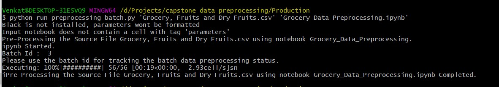

## Setup Production Environment

1. Install python

2. Install pip

3. Run the following command 
   pip install pipenv

4. Run the following command from the project folder. This will install required libraries from Pipfile present in this directory. If the deployment team is not using pipenv, then the libraries in the Pipfile need to be manually installed. 
   pipenv install

5. Run the following command to activate the pipenv environment
   pipenv shell

6. Run the following command to setup the mysql database
   python .\db_setup.py

7. Change the mysql database connection details in the cell below heading "Database Connection" input jupyter notebook and get_db_connection() function in db_setup.py file

## Perform Data Preprocessing

1. Put the source data file in csv format at the location ./data/source

2. Put the input jupyter notebook(.ipynb) file at the location ./notebooks/input

3. Run the following command to start the data preprocessing 
	
   e.g. for preprocessing the data file 'Grocery, Fruits and Dry Fruits.csv' using the notebook 'Grocery_Data_Preprocessing.ipynb' run the below command

   python .\run_preprocessing_batch.py 'Grocery, Fruits and Dry Fruits.csv' Grocery_Data_Preprocessing.ipynb

## Tracking the data preprocessing job status

Open terminal on the project location

1. Run the below command to get the preprocessing job statuses 
   python get_jobs.py

2. Run the below command to get the Preprocessed Data from Database
   python get_preprocessed_data.py

3. Run the below command to get the unprocessed Data from Database
   python get_unprocessed_data.py
